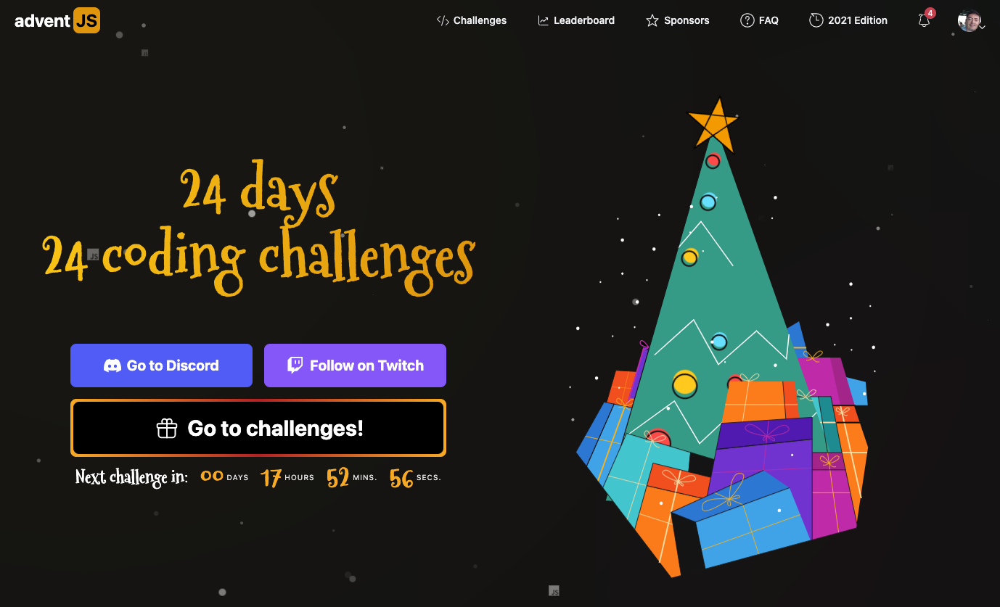

## AdventJS Challenges



##  <strong> [adventJS](https://adventjs.dev/es) is a [@midudev](https://midu.dev/) initiative </strong>

## Challenges

| Day | Title                                                         | Solution                   | Points |
| --- | ------------------------------------------------------------- | -------------------------- | ------ |
| #01 | [Automating Christmas gift wrapping!](./day01/README.md)      | [result](./day01/day01.js) | 131    |
| #02 | [Nobody wants to do extra hours at work](./day02/README.md)   | [result](./day02/day02.js) | 131    |
| #03 | [How many packs of gifts can Santa carry?](./day03/README.md) | [result](./day03/day03.js) | 171    |
| #04 | [Box inside a box and another...](./day04/README.md)          | [result](./day04/day04.js) | 170    |
| #05 | [Optimizing Santa's trips](./day05/README.md)                 | [result](./day05/day05.js) | 112    |
| #06 | [Creating Xmas decorations](./day06/README.md)                | [result](./day06/day06.js) | 120    |
| #07 | [Doing gifts inventory](./day07/README.md)                    | [result](./day07/day07.js) | 200    |
| #08 | [We need a mechanic!](./day08/README.md)                      | [result](./day08/day08.js) | 140    |
| #09 | [Crazy Xmas lights](./day09/README.md)                        | [result](./day09/day09.js) | 300    |
| #10 | [The Santa Claus sleigh jump](./day10/README.md)              | [result](./day10/day10.js) | 260    |
| #11 | [Santa Claus is Scrum Master](./day11/README.md)              | [result](./day11/day11.js) | 180    |
| #12 | [Electric sleighs, wow](./day12/README.md)                    | [result](./day12/day12.js) | 360    |
| #13 | [Backups for Santa Claus files](./day13/README.md)            | [result](./day13/day13.js) | 300    |
| #14 | [The best path](./day14/README.md)                            | [result](./day14/day14.js) | 300    |
| #15 | [Decorating thee Christmas tree](./day15/README.md)           | [result](./day15/day15.js) | 80     |
| #16 | [Fixing Santa Claus' letters](./day16/README.md)              | [result](./day16/day16.js) | 140    |
| #17 | [Carrying gifts in bags](./day17/README.md)                   | [result](./day17/day17.js) | 100    |
| #18 | [We ran out of ink!](./day18/README.md)                       | [result](./day18/day18.js) | 120    |
| #19 | [Sorting the toys!](./day19/README.md)                        | [result](./day19/day19.js) | 300    |
| #20 | [More chanllenging trips](./day20/README.md)                  | [result](./day20/day20.js) | 10     |
| #21 | [Creating the gifts table](./day21/README.md)                 | [result](./day21/day21.js) | 110    |
| #22 | [The lights in sync](./day22/README.md)                       | [result](./day22/day22.js) | 350    |
| #23 | [Santa Claus Compiler](./day23/README.md)                     | [result](./day23/day23.js) | 10     |
| #24 | [The last challenge is a maze](./day24/README.md)             | [result](./day24/day24.js) | 150    |

## Tests

In order to execute Unit Test, first of all you need to install Jest dependency by running:

```
npm install
```

And then, you can run test by typing:

```
  npm run test
```
